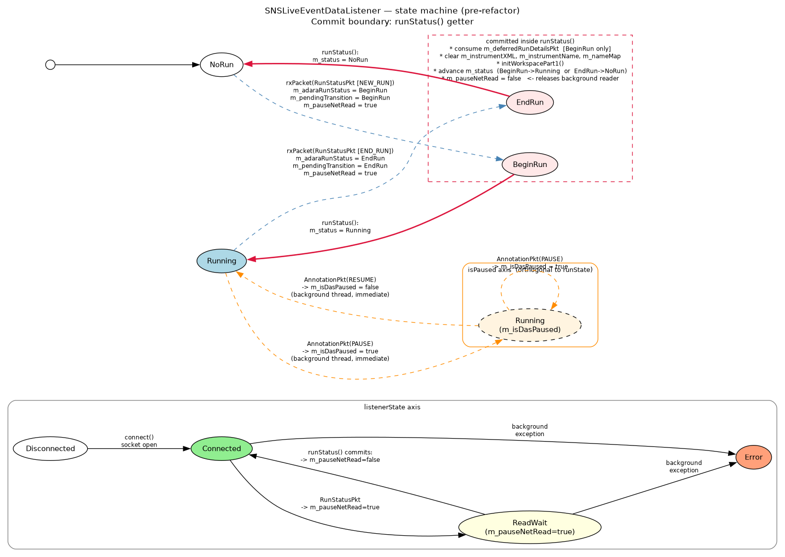
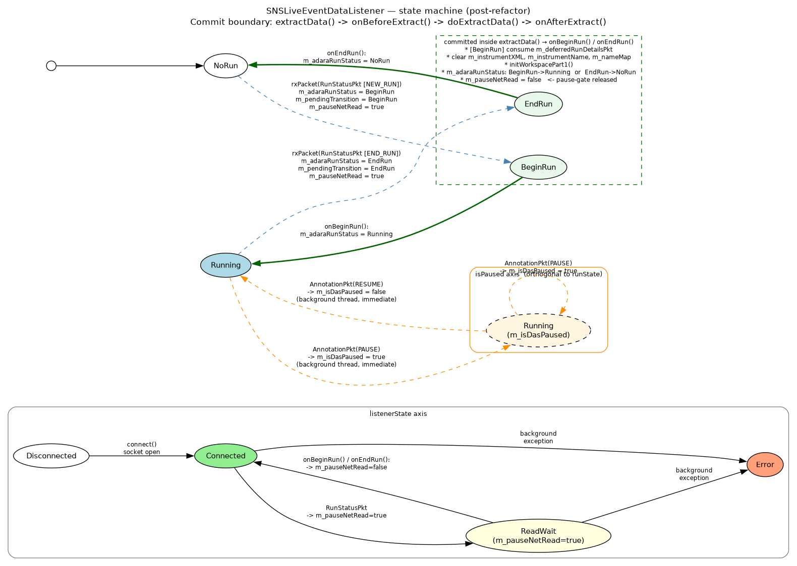

.. _SNSLiveEventDataListenerRefactoring:

``SNSLiveEventDataListener`` refactoring
==========================================

This document covers the listener-specific aspects of the v3 live-listener
refactor (the ADARA packet flow, the deferred ``RunStatusPkt`` handling,
the ``m_pauseNetRead`` back-pressure mechanism, and the state-machine
diagrams) for ``SNSLiveEventDataListener``.

For the generic interface — the four pure-getter queries, the
``extractData()`` template method, the migration recipe, and worked
examples for non-SNS listeners — see :ref:`LiveListenerMigration`.

.. contents::
   :local:
   :depth: 2

Scope
-----

``SNSLiveEventDataListener`` is the most complex concrete
``ILiveListener`` subclass in the tree.  It is the *only* listener
that:

* maintains a real ``BeginRun`` / ``EndRun`` edge-detection contract
  with its consumers;
* defers run-status side effects (cache clears, workspace re-init,
  deferred-packet consumption) across thread boundaries;
* uses an explicit back-pressure flag (``m_pauseNetRead``) between
  the background reader and the foreground extractor;
* has a documented pause/resume orthogonal axis driven by ADARA
  annotation packets.

Everything in this document applies to ``SNSLiveEventDataListener``
specifically.  Other listeners are simpler and are covered in
:ref:`LiveListenerMigration`.

ADARA protocol context
----------------------

The SNS live-event stream is the ADARA protocol.  Three packet types
are relevant to the state machine:

* ``ADARA::RunStatusPkt`` — carries ``NEW_RUN`` (run is starting) and
  ``END_RUN`` (run is ending) markers.  Drives the ``runState()`` axis.
* ``ADARA::AnnotationPkt`` — carries ``PAUSE`` and ``RESUME`` markers.
  Drives the ``isPaused()`` axis.
* ``ADARA::BankedEventPkt`` — carries the actual neutron-event
  records.  Gated on ``m_isDasPaused`` so paused events are discarded.

Two orthogonal state axes
~~~~~~~~~~~~~~~~~~~~~~~~~~

The ADARA protocol exposes two independent state axes that the
legacy ``runStatus()`` conflated:

* **Run state** — whether the DAS is in a run
  (``NoRun / BeginRun / Running / EndRun``).  Driven by
  ``RunStatusPkt``.  Transitions require workspace-level coordination
  (cache clears, re-init), so they are queued and committed in
  ``extractData()``.

* **Pause state** — whether the current run is paused.  Driven by
  ``AnnotationPkt`` ``PAUSE`` / ``RESUME`` markers.  Orthogonal to
  run state: a run can be in ``Running`` status while paused, and the
  ADARA protocol does not change the ``RunStatus`` field on a pause.
  Pause state has **no workspace-level side effects** beyond gating
  event appending, so it is applied immediately in the background
  thread, not queued.

A summary of where each axis is read and written:

.. list-table::
   :header-rows: 1
   :widths: 35 30 35

   * - Question
     - Answer
     - Type
   * - What is the DAS run state right now?
     - ``RunStatus``
     - pure read (``runState()``)
   * - Is the current run paused?
     - ``bool``
     - pure read (``isPaused()``)
   * - Is the listener connected / back-pressure / errored?
     - ``ListenerState``
     - pure read (``listenerState()``)
   * - What run-state transition (if any) did the most recent
       ``extractData()`` consume?
     - ``optional<RunStatus>``
     - pure read (``lastTransition()``)

Pre-refactor problem
--------------------

The legacy ``SNSLiveEventDataListener::runStatus()`` (roughly lines
1495–1534 in the pre-refactor ``SNSLiveEventDataListener.cpp``)
performed *all* of the following inside what callers treated as a
getter:

* Returned the cached ``m_status`` value.
* On ``BeginRun``: consumed ``m_deferredRunDetailsPkt`` via
  ``setRunDetails(*m_deferredRunDetailsPkt)``, reset the deferred
  packet, advanced ``m_status`` to ``Running``.
* On ``EndRun``: cleared ``m_instrumentXML``, ``m_instrumentName``,
  ``m_dataStartTime``, advanced ``m_status`` to ``NoRun``.
* Unconditionally: cleared the ``m_pauseNetRead`` back-pressure flag,
  releasing the background reader.
* Implicitly: marked the workspace as needing re-initialisation and
  ran ``initWorkspacePart1()`` to populate it.

This produced four distinct problems:

1. **Conflated state.**  A single ``RunStatus`` return value reported
   both the DAS run state and the listener's internal FSM position.
2. **Hidden side effects.**  Every call to ``runStatus()`` mutated
   caches and consumed packets.  Reading the state without changing
   it was impossible.
3. **The "little white lie" path.**  When ``NEW_RUN`` arrived before
   the workspace was initialised, ``rxPacket(RunStatusPkt)`` skipped
   the ``BeginRun`` transition and pretended the state was already
   ``Running``, preserving the workspace-init invariant but at the
   cost of a non-obvious code path.
4. **Stand-alone ``LoadLiveData`` deadlock.**  ``LoadLiveData`` does
   not call ``runStatus()``.  After ``rxPacket(RunStatusPkt)`` set
   ``m_pauseNetRead = true``, nothing ever cleared it.  The
   background reader stopped, the workspace could not be
   re-initialised, and ``extractData()`` either timed out
   (``NotYet``) or spun on a stale workspace.

A fifth, more subtle issue: ``MonitorLiveData`` worked correctly *only
because* it happened to call ``extractData()`` first and
``runStatus()`` second within each polling iteration.  Nothing in
the type system enforced that ordering; it was an undocumented
contract.

New state model
---------------

The conflated ``m_status`` member is split into three:

* ``m_adaraRunStatus`` — what the DAS run state is right now (read by
  ``runState()``).  Written by ``rxPacket(RunStatusPkt)`` and by the
  ``onBeginRun()`` / ``onEndRun()`` hooks.
* ``m_pendingTransition`` — exactly one run-state edge waiting to be
  consumed by ``extractData()`` (queued by
  ``rxPacket(RunStatusPkt)``, promoted to ``m_lastTransition`` by
  ``onBeforeExtract()`` and applied via ``onBeginRun()`` /
  ``onEndRun()`` in ``onAfterExtract()``).
* ``m_lastTransition`` — what the most recent ``extractData()``
  consumed (read by ``lastTransition()``).

The pause flag is renamed for clarity: ``m_runPaused`` →
``m_isDasPaused``, read by ``isPaused()``.

The back-pressure flag ``m_pauseNetRead`` keeps both its name and its
meaning, to keep the diff focused and the explanatory comments in
``rxPacket(RunStatusPkt)`` intelligible.

Single-slot invariant
~~~~~~~~~~~~~~~~~~~~~

At most one un-consumed transition can exist at a time.  The background
thread enforces this by setting ``m_pauseNetRead = true`` whenever it
queues a transition; the background reader then blocks until
``extractData()`` releases ``m_pauseNetRead`` via the hook.  The
"little white lie" path (``NEW_RUN`` with workspace not yet
initialised) queues *no* transition and sets *no* back-pressure, so it
does not violate the invariant.

The invariant is checked explicitly in ``rxPacket(RunStatusPkt)``;
violation is treated as an implementation error and raises:

.. code-block:: cpp

   if (m_pendingTransition) {
       throw std::runtime_error(
           "SNSLiveEventDataListener: pending run-state transition was not "
           "consumed before a new transition arrived — back-pressure invariant "
           "violation.");
   }
   m_pendingTransition = BeginRun;   // or EndRun
   m_pauseNetRead      = true;

This is a ``runtime_error`` rather than a debug-only assertion so the
condition is never silently masked in release builds.

Header summary
~~~~~~~~~~~~~~

.. code-block:: cpp

   class SNSLiveEventDataListener : public API::LiveListener,
                                    public Poco::Runnable,
                                    public ADARA::Parser {
   public:
       // pure queries
       RunStatus runState() const override;
       bool isPaused() const override;
       ListenerState listenerState() const override;
       std::optional<RunStatus> lastTransition() const override;

       int runNumber() const override { return m_runNumber; }
       bool isConnected() override;

   protected:
       /// Phase 1 of extraction: promote any queued run-state transition
       /// (m_pendingTransition) into m_lastTransition for caller visibility.
       /// Called by LiveListener::extractData() before doExtractData().
       /// Runs on the foreground thread.  Does NOT invoke onBeginRun() /
       /// onEndRun() — those hooks are deferred to onAfterExtract() so the
       /// event buffer survives until doExtractData() has harvested it.
       void onBeforeExtract() override;

       /// Phase 2/3 of extraction: wait for workspace initialisation,
       /// build the new EventWorkspace, swap, and return it.
       std::shared_ptr<API::Workspace> doExtractData() override;

       /// Phase 4 of extraction: dispatch the committed transition to
       /// onBeginRun() / onEndRun() (applying their workspace-reset side
       /// effects after the caller has received the harvested workspace)
       /// and release the m_pauseNetRead back-pressure flag.
       void onAfterExtract() override;

       /// Explicit, named state-transition hooks.
       virtual void onBeginRun();
       virtual void onEndRun();
       virtual void onRunPause(bool paused);

   private:
       // ADARA / DAS state (written by background thread)
       RunStatus m_adaraRunStatus{NoRun};
       std::shared_ptr<ADARA::RunStatusPkt> m_deferredRunDetailsPkt;

       // Pending run-state transition (background -> foreground).
       // INVARIANT: at most one un-consumed transition at a time.
       std::optional<RunStatus> m_pendingTransition;

       // Result of the most recent commit (read by lastTransition()).
       std::optional<RunStatus> m_lastTransition;
       // True once onBeginRun()/onEndRun() has been dispatched for the
       // current m_lastTransition edge; prevents double-dispatch on
       // subsequent extracts and gates clearing of m_lastTransition.
       bool m_lastTransitionApplied{false};

       // Listener health
       std::shared_ptr<std::runtime_error> m_backgroundException;

       // Existing members (unchanged)
       int m_runNumber{0};
       DataObjects::EventWorkspace_sptr m_eventBuffer;
       bool m_workspaceInitialized{false};
       std::string m_instrumentName;
       std::string m_instrumentXML;
       /* ... etc. ... */
       mutable std::mutex m_mutex;        ///< guards all of the above
       bool m_pauseNetRead{false};        ///< back-pressure flag
       bool m_isDasPaused{false};         ///< set by onRunPause(); read by isPaused()
       NameMapType m_nameMap;
       /* ... etc. ... */
   };

State-machine diagrams
----------------------

Two diagrams below show the ``runState`` evolution for the SNS
listener.  The shape of the state machine is unchanged between
pre- and post-refactor; what changes is **where the transitions are
committed** — and that change is what makes the listener safe to use
from stand-alone ``LoadLiveData``.

In both diagrams:

* Nodes are the four ``runState`` values (``NoRun``, ``BeginRun``,
  ``Running``, ``EndRun``).
* Edges are labelled with the ADARA packet (or call) that triggers
  the transition.
* A dashed box (cluster) encloses the transitions that are
  **committed at a particular point in the code** — i.e. where the
  visible state mutation and the workspace-level side effects
  actually occur.
* The ``isPaused()`` axis is shown as a separate small subgraph; it
  is orthogonal to ``runState`` and applied immediately in the
  background thread.
* The ``listenerState()`` axis is shown as a separate small subgraph.

Pre-refactor: transitions committed inside ``runStatus()``
~~~~~~~~~~~~~~~~~~~~~~~~~~~~~~~~~~~~~~~~~~~~~~~~~~~~~~~~~~

         BeginRun→Running and EndRun→NoRun edges are enclosed in a
         dashed cluster labelled "committed inside runStatus()",
         indicating that the cache clears, workspace re-init, deferred
         RunStatusPkt consumption, and m_pauseNetRead release all
         happen as side effects of the runStatus() getter.

In the pre-refactor design the commit boundary is **the
``runStatus()`` getter itself**.  External callers that never invoke
``runStatus()`` — notably stand-alone ``LoadLiveData`` — never trigger
the transition, ``m_pauseNetRead`` is never released, and the
listener deadlocks.

The diagram source is committed alongside the rendered image at
``dev-docs/source/images/SNSLiveEventDataListener-state-machine-before.dot``;
regenerate the PNG with::

    dot -Tpng -o SNSLiveEventDataListener-state-machine-before.png \
              SNSLiveEventDataListener-state-machine-before.dot

Post-refactor: transitions committed inside ``extractData()``
~~~~~~~~~~~~~~~~~~~~~~~~~~~~~~~~~~~~~~~~~~~~~~~~~~~~~~~~~~~~~

         BeginRun→Running and EndRun→NoRun edges are enclosed in a
         dashed cluster labelled "committed inside extractData()
         (onBeforeExtract promotes m_pendingTransition →
         m_lastTransition; onAfterExtract dispatches onBeginRun /
         onEndRun after doExtractData has harvested the buffer)",
         indicating that the
         cache clears, workspace re-init, deferred-packet consumption,
         and m_pauseNetRead release all happen as part of the
         template-method extractData() call.

In the post-refactor design the commit boundary is **the
``extractData()`` template method** — ``onBeforeExtract()`` promotes
the queued ``m_pendingTransition`` into ``m_lastTransition`` so the
caller's ``runStatus()`` / ``lastTransition()`` polls observe it, and
``onAfterExtract()`` (which runs after ``doExtractData()`` has
harvested the event buffer) then dispatches the named hook
(``onBeginRun()`` / ``onEndRun()``) whose workspace-reset side
effects must not run before the run's final events are handed to the
caller.  Because every consumer of ``ILiveListener`` calls
``extractData()``, every consumer drives the FSM forward, and
stand-alone ``LoadLiveData`` works without changes.

The diagram source is committed alongside the rendered image at
``dev-docs/source/images/SNSLiveEventDataListener-state-machine-after.dot``;
regenerate the PNG with the analogous ``dot`` command.

Implementation
--------------

Pure getters
~~~~~~~~~~~~

.. code-block:: cpp

   ILiveListener::RunStatus
   SNSLiveEventDataListener::runState() const {
       if (m_backgroundException) throw *m_backgroundException;
       std::lock_guard lock(m_mutex);
       return m_adaraRunStatus;
   }

   ListenerState
   SNSLiveEventDataListener::listenerState() const {
       std::lock_guard lock(m_mutex);
       if (m_backgroundException) return ListenerState::Error;
       if (!m_isConnected)        return ListenerState::Disconnected;
       if (m_pauseNetRead)        return ListenerState::ReadWait;
       return ListenerState::Connected;
   }

   std::optional<ILiveListener::RunStatus>
   SNSLiveEventDataListener::lastTransition() const {
       if (m_backgroundException) throw *m_backgroundException;
       std::lock_guard lock(m_mutex);
       return m_lastTransition;
   }

   bool SNSLiveEventDataListener::isPaused() const {
       std::lock_guard lock(m_mutex);
       return m_isDasPaused;
   }

All four getters are ``const`` and have no side effects.  None mutate
``m_adaraRunStatus``, ``m_isDasPaused``, ``m_pendingTransition``,
``m_pauseNetRead``, or any cache.

Background reader and packet handlers
~~~~~~~~~~~~~~~~~~~~~~~~~~~~~~~~~~~~~

In ``rxPacket(const ADARA::RunStatusPkt &pkt)`` the changes versus the
legacy implementation are:

* Replace assignments to the conflated ``m_status`` with assignments
  to ``m_adaraRunStatus``.
* On ``NEW_RUN`` with ``m_workspaceInitialized == true``: enforce the
  single-slot invariant, queue ``m_pendingTransition = BeginRun``,
  set ``m_pauseNetRead = true``.
* On ``NEW_RUN`` with ``m_workspaceInitialized == false``: preserve
  the existing "little white lie" path — set ``m_adaraRunStatus =
  Running``, call ``setRunDetails(pkt)`` directly, queue **no**
  transition, set **no** back-pressure.  The long explanatory comment
  in the legacy ``rxPacket(RunStatusPkt)`` is preserved verbatim.
* On ``END_RUN``: enforce the single-slot invariant, queue
  ``m_pendingTransition = EndRun``, set ``m_pauseNetRead = true``,
  set ``m_adaraRunStatus = EndRun``, copy ``setRunDetails(pkt)`` if
  ``!haveRunNumber`` (unchanged).

In ``rxPacket(const ADARA::AnnotationPkt &pkt)``, ``PAUSE`` and
``RESUME`` markers call ``onRunPause(true/false)`` directly from the
background thread.  This is intentional: pause state has no
workspace-level side effects (it only gates event appending in
``rxPacket(BankedEventPkt)``), so applying it immediately at the
packet boundary gives the most accurate event filtering relative to
the DAS timeline.  The pause/resume path does **not** use
``m_pendingTransition`` and does **not** set ``m_pauseNetRead``.

``extractData()`` — the only commit point
~~~~~~~~~~~~~~~~~~~~~~~~~~~~~~~~~~~~~~~~~~

The body below is presented as a single ``extractData()`` for clarity.
In the actual implementation it is split across the
``LiveListener::extractData()`` template method (which handles the
``m_backgroundException`` rethrow), ``onBeforeExtract()`` (Phase 1:
promote ``m_pendingTransition`` into ``m_lastTransition`` for caller
visibility), ``doExtractData()`` (Phase 2/3: workspace-init wait +
EventWorkspace build + swap), and ``onAfterExtract()`` (Phase 4:
dispatch the committed transition to ``onBeginRun()`` /
``onEndRun()`` and release ``m_pauseNetRead``).  The hook dispatch is
deferred to Phase 4 so the workspace-reset side effects of the named
hooks run *after* ``doExtractData()`` has harvested the per-run event
buffer.  The exception-safety guarantees described below survive the
split unchanged.

.. code-block:: cpp

   std::shared_ptr<Workspace>
   SNSLiveEventDataListener::extractData() {     // conceptually
       if (m_backgroundException) throw *m_backgroundException;

       // ---- Phase 1: promote pending transition for caller visibility -----
       std::optional<RunStatus> committed;
       {
           std::lock_guard lock(m_mutex);
           if (m_pendingTransition) {
               m_lastTransition = m_pendingTransition;
               m_pendingTransition.reset();
               m_lastTransitionApplied = false;     // armed for Phase 4
           } else if (m_lastTransitionApplied) {
               // Previous edge already dispatched on the prior extractData()
               // and the caller has had a chance to observe it; clear so
               // subsequent steady-state polls fall through to runState().
               m_lastTransition.reset();
               m_lastTransitionApplied = false;
           }
       }

       // ---- Phase 2: wait for workspace initialisation (unchanged) -----
       static const double maxBlockTime = 10.0;
       const DateAndTime endTime = DateAndTime::getCurrentTime() + maxBlockTime;
       while (!m_workspaceInitialized && DateAndTime::getCurrentTime() < endTime) {
           Poco::Thread::sleep(100);
       }
       if (!m_workspaceInitialized) {
           throw Exception::NotYet("The workspace has not yet been initialized.");
       }
       if (m_ignorePackets) {
           throw Exception::NotYet("Waiting for a run to start.");
       }

       // ---- Phase 3: build the new EventWorkspace and swap (unchanged) -
       EventWorkspace_sptr temp = std::dynamic_pointer_cast<EventWorkspace>(
           API::WorkspaceFactory::Instance().create(
               "EventWorkspace", m_eventBuffer->getNumberHistograms(), 2, 1));
       API::WorkspaceFactory::Instance().initializeFromParent(*m_eventBuffer, *temp, false);
       temp->mutableRun().clearOutdatedTimeSeriesLogValues();
       for (auto &monitorLog : m_monitorLogs)
           temp->mutableRun().removeProperty(monitorLog);
       m_monitorLogs.clear();

       auto monitorBuffer = m_eventBuffer->monitorWorkspace();
       if (monitorBuffer) {
           auto newMonitorBuffer = WorkspaceFactory::Instance().create(
               "EventWorkspace", monitorBuffer->getNumberHistograms(), 1, 1);
           WorkspaceFactory::Instance().initializeFromParent(
               *monitorBuffer, *newMonitorBuffer, false);
           temp->setMonitorWorkspace(newMonitorBuffer);
       }
       {
           std::lock_guard lock(m_mutex);
           std::swap(m_eventBuffer, temp);
       }

       // ---- Phase 4: dispatch committed transition AFTER harvest ----------
       std::optional<RunStatus> edge;
       bool needDispatch = false;
       {
           std::lock_guard lock(m_mutex);
           edge = m_lastTransition;
           if (edge && !m_lastTransitionApplied) {
               needDispatch = true;
               m_lastTransitionApplied = true;
           }
       }
       if (needDispatch) {
           switch (*edge) {
             case BeginRun: onBeginRun(); break;
             case EndRun:   onEndRun();   break;
             default:       break;          // Running / NoRun not queued
           }
           m_pauseNetRead = false;          // back-pressure released
       }

       return temp;
   }

Important properties:

* **Phase 1 runs once per call** and is a no-op when no new edge is
  pending.  Promotion to ``m_lastTransition`` (re-)arms Phase 4.
* **Hook dispatch happens in Phase 4, after the buffer swap**, so a
  run's accumulated events are never wiped by ``onBeginRun()`` /
  ``onEndRun()`` before they are returned to the caller.
* **``m_lastTransition`` is visible to the caller after
  ``extractData()`` returns** — it is cleared at the start of the
  *next* ``onBeforeExtract()`` only after Phase 4 marked it applied,
  so the caller's post-extract ``runStatus()`` / ``lastTransition()``
  poll still observes the just-committed edge.
* **Phase 1 holds the mutex only while reading the queue**, not while
  running the transition hook.  Hooks may safely take the mutex
  themselves.
* **Exception-safe.**  If Phase 2 throws ``Exception::NotYet``,
  Phase 4 never runs and ``m_lastTransitionApplied`` stays ``false``;
  the next retry call sees no new pending transition (correct — it
  was promoted), ``m_lastTransition`` retains its value, and Phase 4
  on the next successful call dispatches the hook exactly once.

Transition hooks
~~~~~~~~~~~~~~~~

.. code-block:: cpp

   void SNSLiveEventDataListener::onBeginRun() {
       std::lock_guard lock(m_mutex);

       m_workspaceInitialized = false;

       // Cache clears: exactly the set the legacy runStatus() clears.
       m_instrumentXML.clear();
       m_instrumentName.clear();
       // Note: m_dataStartTime NOT cleared on BeginRun — matches legacy.
       m_nameMap.clear();

       initWorkspacePart1();

       if (!m_deferredRunDetailsPkt) {
           // Invariant: rxPacket(NEW_RUN) must have stashed the RunStatusPkt
           // before queueing BeginRun. Reaching here means a producer queued
           // a BeginRun transition without populating m_deferredRunDetailsPkt,
           // which is an implementation error in the listener itself.
           throw std::runtime_error(
               "SNSLiveEventDataListener::onBeginRun(): "
               "m_deferredRunDetailsPkt is null — invariant violation.");
       }
       setRunDetails(*m_deferredRunDetailsPkt);
       m_deferredRunDetailsPkt.reset();

       m_adaraRunStatus = Running;   // we've crossed the edge
       m_pauseNetRead   = false;     // release the background reader
   }

   void SNSLiveEventDataListener::onEndRun() {
       std::lock_guard lock(m_mutex);

       m_workspaceInitialized = false;

       m_instrumentXML.clear();
       m_instrumentName.clear();
       m_dataStartTime = Types::Core::DateAndTime();   // cleared only on EndRun
       m_nameMap.clear();

       initWorkspacePart1();

       m_adaraRunStatus = NoRun;
       m_pauseNetRead   = false;
   }

   void SNSLiveEventDataListener::onRunPause(bool paused) {
       // Called directly from rxPacket(AnnotationPkt) in the background
       // thread — NOT dispatched through the pending-transition queue.
       //
       // Pause state is orthogonal to run state: m_adaraRunStatus remains
       // Running while the run is paused. m_isDasPaused is read by
       // isPaused() and by rxPacket(BankedEventPkt) to gate event
       // appending.
       //
       // Applying this immediately (rather than deferring to extractData())
       // gives accurate event counts: events received after the PAUSE
       // annotation but before the next extractData() call are correctly
       // discarded.
       std::lock_guard lock(m_mutex);
       m_isDasPaused = paused;
   }

Notes:

* The set of side effects in ``onBeginRun()`` / ``onEndRun()`` is
  identical to what the legacy ``runStatus()`` did.  Nothing new is
  cleared, nothing previously cleared is left dirty.
* ``onBeginRun()`` and ``onEndRun()`` are ``protected virtual`` and
  dispatched only from ``onAfterExtract()``.  Unit tests can subclass
  the listener and override the hooks to assert they fired with the
  expected preconditions.
* ``onRunPause()`` is ``protected virtual`` and called only from
  ``rxPacket(AnnotationPkt)`` in the background thread.  Its dispatch
  point differs from ``onBeginRun()`` / ``onEndRun()`` by design.
* The existing ``m_runPaused`` check in ``rxPacket(BankedEventPkt)``
  is updated to reference ``m_isDasPaused``; no other change to that
  function.

Background reader loop
~~~~~~~~~~~~~~~~~~~~~~

.. code-block:: cpp

   void SNSLiveEventDataListener::run() {
       // ... unchanged setup ...
       while (!m_stopThread) {
           while (m_pauseNetRead && !m_stopThread) {
               Poco::Thread::sleep(100);
           }
           if (m_stopThread) break;
           try {
               read();   // ADARA::Parser::read() drives rxPacket() callbacks
           } catch (...) {
               // unchanged exception capture into m_backgroundException
           }
       }
   }

No change versus today.  The ``m_pauseNetRead`` back-pressure is
released by ``onBeginRun()`` / ``onEndRun()`` inside ``extractData()``,
so stand-alone ``LoadLiveData`` no longer deadlocks.

Behaviour preservation (SNS-specific)
-------------------------------------

.. list-table::
   :header-rows: 1
   :widths: 50 22 28

   * - Behaviour
     - Pre-refactor
     - Post-refactor
   * - ``runStatus()`` returns ``BeginRun`` exactly once at the start
       of a run
     - yes, via mutation
     - yes, via ``lastTransition()`` populated by ``extractData()``
   * - ``runStatus()`` returns ``EndRun`` exactly once at the end of
       a run
     - yes
     - yes
   * - Workspace re-initialised at run boundaries
     - inside ``runStatus()``
     - inside ``onBeginRun()`` / ``onEndRun()``
   * - ``m_dataStartTime`` cleared on ``EndRun`` only, not on
       ``BeginRun``
     - yes
     - yes
   * - ``m_instrumentXML``, ``m_instrumentName``, ``m_nameMap``
       cleared at both boundaries
     - yes
     - yes
   * - ``m_deferredRunDetailsPkt`` consumed at ``BeginRun``
     - yes
     - yes, inside ``onBeginRun()``
   * - ``m_pauseNetRead`` released after the boundary is consumed
     - inside ``runStatus()``
     - inside ``onBeginRun()`` / ``onEndRun()``
   * - "Little white lie" path when ``NEW_RUN`` arrives before
       ``m_workspaceInitialized``
     - yes
     - yes — code in ``rxPacket(RunStatusPkt)`` preserved verbatim
   * - ``m_isDasPaused`` flips on ``AnnotationPkt`` PAUSE / RESUME
     - yes, inline
     - yes, routed through ``onRunPause()`` in background thread
   * - Paused events discarded at the correct packet boundary
     - yes
     - yes — ``m_isDasPaused`` flipped immediately in background
       thread, not deferred
   * - ``isPaused()`` query available without calling ``runStatus()``
     - **no**
     - yes (``isPaused()`` is a ``const`` pure getter)
   * - ``MonitorLiveData`` workspace renaming triggers on
       ``BeginRun`` / ``EndRun``
     - yes
     - yes (legacy ``runStatus()`` shim returns the edge)
   * - Stand-alone ``LoadLiveData`` produces a workspace
     - **no** (deadlocks)
     - yes (commit happens inside ``extractData()``)
   * - Listener can be queried for its state without mutating it
     - **no**
     - yes (all queries ``const``)

There is one behaviour that is intentionally not preserved, and it is
the bug the refactor exists to fix: stand-alone ``LoadLiveData``
previously deadlocked after a run boundary; it now succeeds.

Appendix — pre-existing defect: ``m_ignorePackets`` is never set ``true``
--------------------------------------------------------------------------

This is a **pre-existing defect** in the upstream
``SNSLiveEventDataListener``, discovered while writing the new
integration-test suite.  It is **not** introduced by the v3 refactor;
it predates the refactor by many years.  It is documented here so that
maintainers do not waste time hunting it during code review of the
refactor PR.

Summary
~~~~~~~

``SNSLiveEventDataListener::m_ignorePackets`` is declared with an
in-class initialiser of ``false`` and is **never assigned ``true``
anywhere in the codebase**.  As a consequence:

* The "filter packets until run start" path
  (``m_filterUntilRunStart``) is unreachable.
* The "filter packets until absolute start time" path is unreachable.
* The variable-value packet cache (``m_variableMap``) is populated by
  the ``rxPacket(VariableU32Pkt&)`` / ``VariableDoublePkt`` /
  ``VariableStringPkt`` overloads but is **never replayed**, because
  ``replayVariableCache()`` is only called from inside the
  ``if (!m_ignorePackets) { ... }`` block of ``ignorePacket()``, which
  is itself reached only when ``m_ignorePackets`` is ``true``.
* The ``extractData()`` guard
  ``if (m_ignorePackets) throw Exception::NotYet("Waiting for a run to start.");``
  can never throw.

In short: a chunk of ``SNSLiveEventDataListener`` that exists
specifically to support ``StartLiveData``'s "from start of run" and
"from absolute time" modes is dead code as currently written.

Evidence
~~~~~~~~

The only writes to ``m_ignorePackets`` are *clears* inside
``ignorePacket()`` — there is no ``m_ignorePackets = true;`` anywhere
in the tree.  ``start()`` parses the requested ``startTime`` to decide
which filter mode to use, but only sets ``m_filterUntilRunStart``,
never ``m_ignorePackets``:

.. code-block:: cpp

   void SNSLiveEventDataListener::start(const Types::Core::DateAndTime startTime) {
       m_startTime = startTime;
       if (m_startTime.totalNanoseconds() == 1000000000) {
           // "from start of previous run" sentinel
           m_filterUntilRunStart = true;
           // m_ignorePackets = true;   // <-- MISSING
       }
       // else if (m_startTime != DateAndTime()) {
       //     m_ignorePackets = true;   // <-- MISSING (time-based filter)
       // }
       m_thread.start(*this);
   }

The ``else`` branch in ``ignorePacket()`` whose comment reads
*"Filter based solely on time"* is, today, unreachable without the
missing assignment in ``start()``.

Provenance
~~~~~~~~~~

This was checked against multiple points in the upstream history.  The
defect is present in:

* ``ekapadi/mantid`` @ ``EWM15431_live-listener-interface`` (the v3
  refactor branch),
* ``ekapadi/mantid`` @ ``ornl-next``,
* ``mantidproject/mantid`` @ current ``main``,
* ``mantidproject/mantid`` @ ``a86c1e02`` (~2018).

The defect is therefore pre-existing in upstream and predates any of
the work on the v3 refactor.

Impact
~~~~~~

* ``StartLiveData`` "Now" mode (no ``StartTime``, no historical
  replay) is unaffected — that path was never supposed to set
  ``m_ignorePackets``.
* ``StartLiveData`` "from start of run" mode: historical packets sent
  by SMS that precede the most recent ``NEW_RUN`` are **not** filtered
  out.  The user sees whatever SMS happens to send.
* ``StartLiveData`` with a non-default ``StartTime``: packets older
  than ``m_startTime`` are **not** filtered out.
* Variable-value packets that arrive during what *should* be the
  filtered prefix are not deferred-and-replayed; they are processed
  immediately, in arrival order, with no end-of-filter coalescing.

Why it has gone unnoticed: the only existing unit suite
(``SNSLiveEventDataListenerNoNetworkTest.h``) does not exercise the
filter paths, and the disabled legacy integration suite was
network-dependent and unregistered.  The behavioural difference is
subtle: extra historical events at the front of the stream rather than
a hard failure.

Recommended fix (separate PR)
~~~~~~~~~~~~~~~~~~~~~~~~~~~~~

In ``SNSLiveEventDataListener::start()``:

.. code-block:: cpp

   void SNSLiveEventDataListener::start(const Types::Core::DateAndTime startTime) {
       m_startTime = startTime;

       if (m_startTime.totalNanoseconds() == 1000000000) {
           // "From start of previous run" sentinel: replay everything,
           // then filter out all packets older than the next NEW_RUN.
           m_filterUntilRunStart = true;
           m_ignorePackets       = true;
       } else if (m_startTime != Types::Core::DateAndTime()) {
           // Absolute-time filter: drop everything older than m_startTime.
           m_ignorePackets = true;
       }
       // else: "Now" mode — no historical filtering, m_ignorePackets
       // stays false (the default).

       m_thread.start(*this);
   }

The fix must be accompanied by:

* A targeted no-network unit test for ``start()`` itself, asserting
  that the correct combination of ``m_ignorePackets`` /
  ``m_filterUntilRunStart`` is produced for each of the three
  ``startTime`` inputs (sentinel, absolute past time,
  default-constructed "now").
* Re-enabling any integration tests that were ``TS_SKIP``-guarded
  pending this fix.
* A conversation with the SNS team confirming the intended semantics
  — in particular, when the sentinel ``1e9 ns`` value is used, is the
  intent really to ignore *all* packets until a ``NEW_RUN``, or is the
  intent to ignore everything older than the *previous* run's
  ``NEW_RUN``?  The dead code implies the former; the comment in
  ``start()`` implies the latter.

Integration-test PRs that depend on the filter paths working should
guard those tests with ``TS_SKIP``, citing this defect.

Testing
-------

Unit tests
~~~~~~~~~~

The following unit tests cover the SNS-specific state machine.  All
live in ``Framework/LiveData/test/SNSLiveEventDataListenerTest.h``.

* ``test_runState_pure_getter_does_not_mutate`` — call ``runState()``
  100× across each ADARA state; assert no internal field changes.
* ``test_listenerState_reflects_connection_and_pause`` — drive
  connect/disconnect/pause via test fixture; assert each
  ``ListenerState`` value is reachable.
* ``test_lastTransition_reports_BeginRun_once`` — inject ``NEW_RUN``
  packet, call ``extractData()``, assert
  ``lastTransition() == BeginRun``; call ``extractData()`` again with
  no new packet, assert ``lastTransition() == nullopt``.
* ``test_lastTransition_reports_EndRun_once`` — symmetric.
* ``test_extractData_commits_BeginRun_side_effects`` — subclass
  overrides ``onBeginRun()`` to record entry; inject ``NEW_RUN``;
  call ``extractData()``; assert hook fired exactly once, caches
  cleared, ``m_pauseNetRead == false``, workspace re-initialised.
* ``test_extractData_commits_EndRun_side_effects`` — symmetric, plus
  ``m_dataStartTime`` cleared.
* ``test_no_transition_no_hook`` — inject normal event packets, call
  ``extractData()``, assert neither hook fires.
* ``test_onRunPause_invoked_for_pause_resume_markers`` — feed
  ``AnnotationPkt(PAUSE)`` / ``AnnotationPkt(RESUME)`` directly;
  assert ``m_isDasPaused`` flips and ``isPaused()`` returns the
  correct value.  Assert that ``m_adaraRunStatus`` is **not** modified
  by pause/resume.
* ``test_isPaused_orthogonal_to_runState`` — assert that ``runState()``
  returns ``Running`` before and after a PAUSE annotation; only
  ``isPaused()`` changes.
* ``test_legacy_runStatus_returns_edge_then_state`` — the deprecated
  wrapper must match the historical sequence:
  ``BeginRun, Running, Running, ..., EndRun, NoRun``.
* ``test_background_exception_propagates_from_all_getters`` — set
  ``m_backgroundException``; assert ``runState()``, ``isPaused()``,
  ``listenerState()``, ``lastTransition()``, ``extractData()``, and
  ``runStatus()`` all throw (where applicable).

Concurrency tests
~~~~~~~~~~~~~~~~~

* ``test_concurrent_getters_no_data_race`` — 4 reader threads
  spamming ``runState()`` / ``isPaused()`` / ``listenerState()`` /
  ``lastTransition()`` while the background thread injects packets;
  ThreadSanitizer clean.
* ``test_pending_transition_queue_invariant_violation_throws`` —
  using a test fixture that injects packets directly into
  ``rxPacket(RunStatusPkt)`` (bypassing the background reader's
  ``m_pauseNetRead`` gate), call ``rxPacket(NEW_RUN)`` followed
  immediately by ``rxPacket(END_RUN)`` without an intervening
  ``extractData()``.  Assert that the second call throws
  ``std::runtime_error``.  In normal operation the reader's
  ``m_pauseNetRead`` back-pressure prevents this sequence; the test
  exercises the safety net.

Integration tests
~~~~~~~~~~~~~~~~~

* ``test_LoadLiveData_standalone_no_deadlock`` — instantiate
  ``LoadLiveData`` with a fake SNS listener that simulates a
  ``BeginRun`` boundary; assert the algorithm completes within 5 s
  and produces a workspace.  This is the **regression test** for the
  bug that motivated v3.
* ``test_MonitorLiveData_workspace_renaming_unchanged`` — drive a
  ``NoRun → BeginRun → Running → EndRun → NoRun`` sequence; assert
  the output workspace is renamed with the correct suffix at each
  boundary.  Uses the *unmodified* ``MonitorLiveData`` to prove
  backward compatibility.

Further reading
---------------

* :ref:`LiveListenerMigration` — the generic migration guide and
  per-listener worked examples.
* ``Framework/LiveData/inc/MantidLiveData/SNSLiveEventDataListener.h``
* ``Framework/LiveData/src/SNSLiveEventDataListener.cpp``
* ``Framework/API/inc/MantidAPI/LiveListener.h`` — ``extractData()``
  template method.
* ``Framework/API/inc/MantidAPI/ILiveListener.h`` — base-class
  interface.
